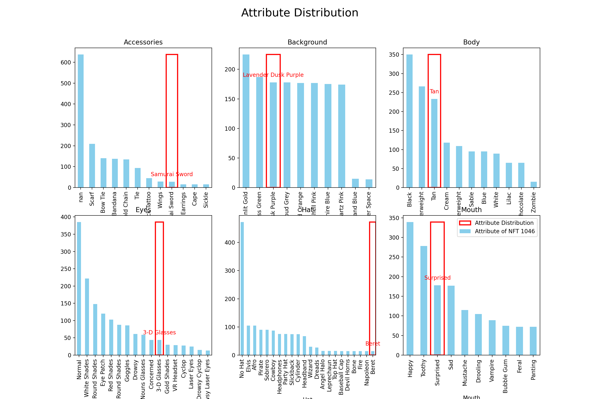
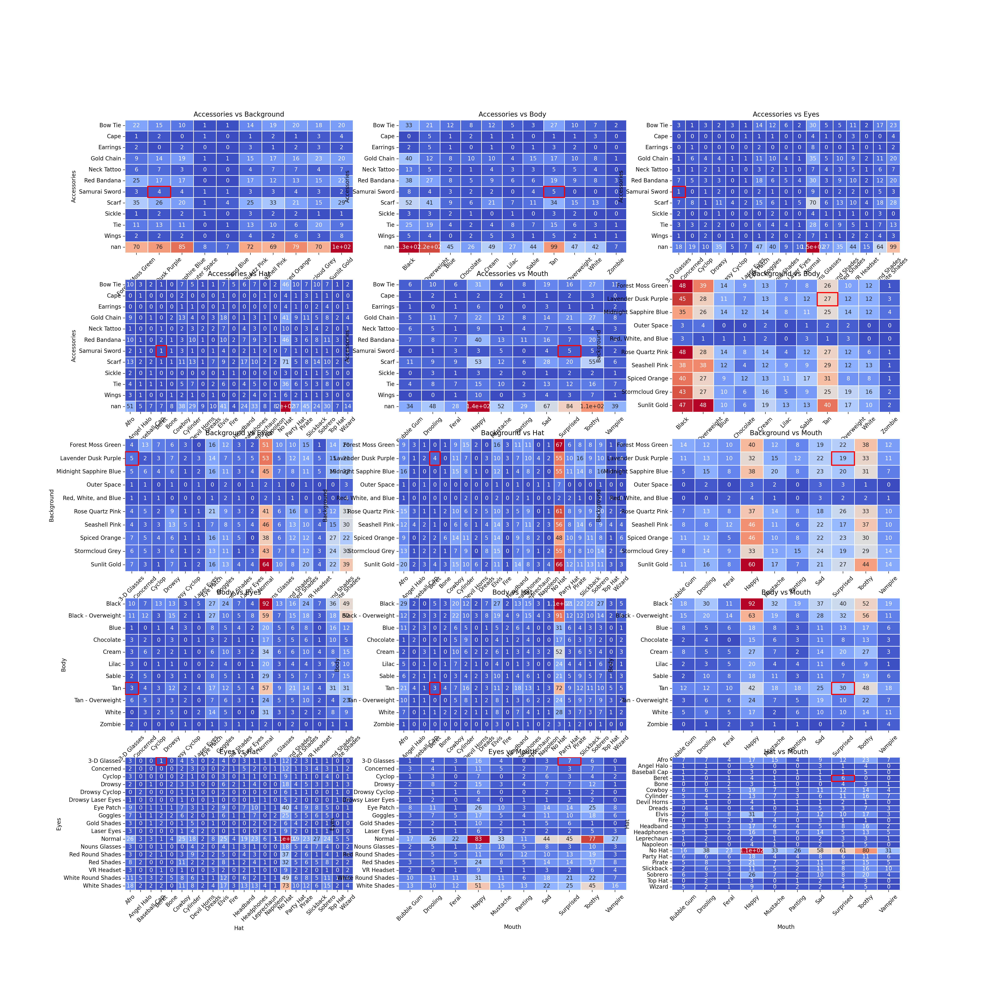
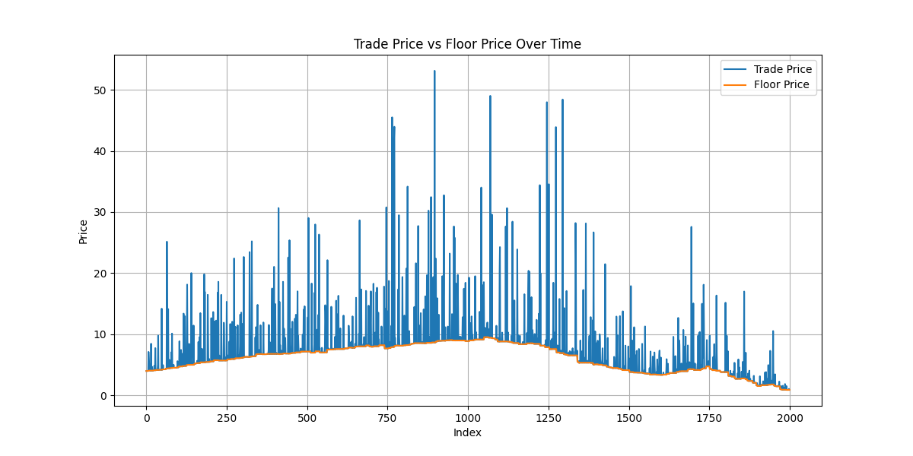

# Fit Frenchie Data Overview

## Datasets

### 1. `fit_frenchie_trades`
This dataset provides trade history for the last 10 days (since the mint) of Fit Frenchies, consisting of 2000 records. The key columns are:
- **`nft_id`**: The unique identifier for each Fit Frenchie sold.
- **`trade_price`**: The price at which the Fit Frenchie was sold.
- **`floor_price`**: The current lowest offer for any Fit Frenchie at the time of the trade.

### 2. `fit_frenchie_attributes`
This dataset contains the full collection metadata, mapping each `nft_id` to its attributes. For example, Fit Frenchie #1046 has the `Background` attribute of `Lavender Dusk Purple`. The dataset includes:
- **`nft_id`**: The unique identifier for each Fit Frenchie (corresponding to `nft_id` in `fit_frenchie_trades`).
- **`Accessories`**: The attribute or trait related to accessories.
- **`Background`**: The attribute or trait related to the background.
- **`Body`**: The attribute or trait related to the body.
- **`Eyes`**: The attribute or trait related to the eyes.
- **`Hat`**: The attribute or trait related to the hat.
- **`Mouth`**: The attribute or trait related to the mouth.

Each attribute has 10-22 possible values.

## Assignment

### Observations

**Data Analysis**:
1. **Attribute Distribution**: Some attributes are rarer than others. For instance, specific `Background` colors or `Accessories` might be less common, potentially influencing the trade price.

The following graph displays the histogram of attributes across the Fit Frenchie dataset. This visualization highlights the frequency of each attribute, revealing that some attributes are less common than others. Additionally, the red box on the histogram indicates the attributes of the specific NFT we are focusing on.



### Pairwise Attribute Analysis

To further understand the relationships and rarity of attributes, we can analyze the joint distribution of attribute pairs. This analysis helps identify pairs of attributes that are frequent individually but rare when combined. Such pairs can significantly influence the value of a Fit Frenchie, as rare attribute combinations often make an NFT more valuable. The red box on the following graph represents the attribute pair for NFT #1046.



2. **Relationship Hypotheses**:
   - **Floor Price vs. Trade Price**: The floor price represents the minimum price a seller is willing to accept. The trade price can be higher if the Fit Frenchie has rare or desirable attributes.

   The following graph confirms our hypothesis about the relationship between trade price and floor price. In the graph, the floor price is depicted in orange, and it is consistently below the traded prices. This visual representation shows that while the floor price sets a minimum value for an NFT, the actual trade prices often exceed this floor price, especially for NFTs with more desirable attributes.

    

   - **Influence of Attributes**: Fit Frenchies with unique or rare attributes are likely to sell for a premium over the floor price. This implies that the rarity and desirability of attributes significantly impact the trade price.

### Modeling Approach

To predict the trade price of a Fit Frenchie, consider the following approaches:

1. **Attribute-Based Prediction**:
   - **Feature Engineering**: Use the attributes to build scarcity metrics frequency and have more features on a nft.
   - **Normalized Trade Price**: Normalize the trade price by the floor price to control for market demand and focus on the influence of attributes. Its important to have this approch because some nft price are really high but this is because the market was bullish at that time and the nft is basic so its imoportant to differenciate both aspects driving the price.
   - **Model Choice**: Use regression models to predict the normalized trade price based on attributes. After predicting the normalized price, adjust by multiplying with the floor price to estimate the actual trade price.

2. **Regression Models**:
   - **Linear Regression**: A straightforward approach where the attributes are used as features and the normalized trade price (floor price-adjusted) as the target.
   - **Tree-Based Models**: Utilize models like Decision Trees, Random Forests, or Gradient Boosting, which can handle categorical features and capture complex relationships between attributes and trade price.
   ```
    Predicted Normalized Price for the NFT 1046: 2.05
    Latest floor price for the NFT 1046: 0.91
    Predicted Price for the NFT 1046: 1.86
    ```

3. **Similar Fit Frenchie Comparison**:
   - **Similarity-Based Pricing**: Identify Fit Frenchies with similar attributes and use their trade prices to estimate the price for the target Frenchie.
   - **Averaging Approach**: Average the trade prices of similar Fit Frenchies to get a more accurate estimate for the target Fit Frenchie. The `knn.ipynb` is showing how to find the nft with the most similar attriburtes and pair, triple etc ... attributes. Then we get the average of tohose and i weight the average accross all similar clusters to find the price of the nft.
   ```
   Final weighted normalized price: 1.46
   Most recent floor price: 0.93
   Most recent trade price: 1.36
   ```

### Recommendations for Pricing Fit Frenchie #1046

To determine the optimal listing price for Fit Frenchie #1046:
1. **Use the Best Model**: Apply the best-performing model from the above approaches to predict the normalized trade price.
2. **Adjust for Floor Price**: Multiply the predicted normalized price by the current floor price to get the estimated trade price. In our case the last traded price was 0.91 so we can take it as a good guess for the next floor price (or we coppuld also have a baseic trend model to predict the next price. For instance we can see on the price chart that the floor price decreased a littlt so we can guess 0.9 or 0.89 can we a good estimation of the next floor price)
3. **Cross-Validate**: Ensure that the model's performance is validated using cross-validation to confirm its robustness and accuracy.
Redsults are very sensistive to the calibration parameters. Also given the very limited trade dataset its hard to get a robust model not overfiting. The following reuslt are for different parameters in the auto ml pipeline and cv split numbers.
```
# Predicted Normalized Price for the NFT 1046: 2.17
# Latest floor price for the NFT 1046: 0.91
# Predicted Price for the NFT 1046: 1.98
```
```
# Predicted Normalized Price for the NFT 1046: 2.05
# Latest floor price for the NFT 1046: 0.91
# Predicted Price for the NFT 1046: 1.86
```

By following these steps, you will be able to provide a well-informed listing price for Fit Frenchie #1046, taking into account both its unique attributes and the market dynamics.
